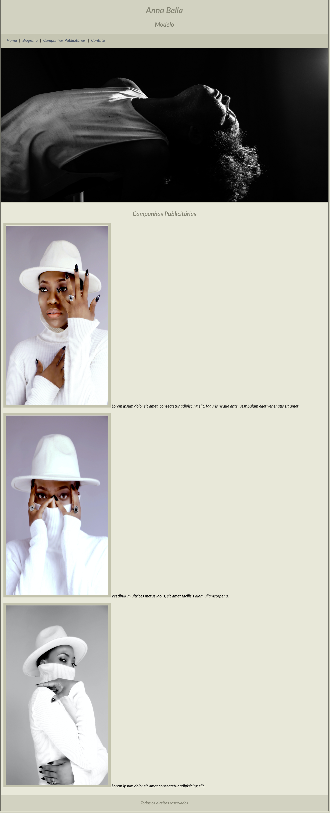

# PROJETO ANNA BELLA CURSO DESENVOLVIMENTO WEB 2022 - UDEMY

Projeto idealizado durante as aulas do curso para utilização dos elementos básicos de CSS. 
Divs, classes, ids, bordas, fontes, cores, estilos de texto, cor e imagem de fundo.
Adaptação do projeto proposto pelo curso.

Fotos :
pexels - banco de imagens gratuitas
by ayodeji-fatunla
by fillipe-gomes

Layout com recursos básicos

